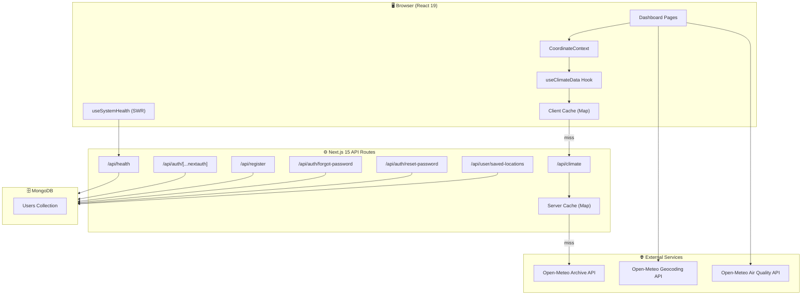
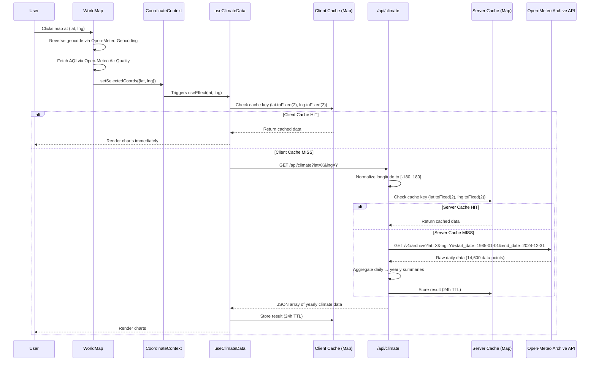
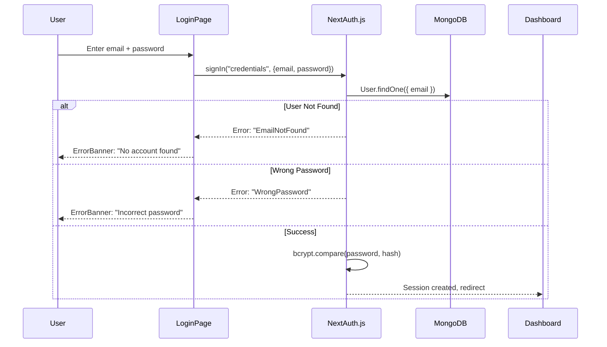
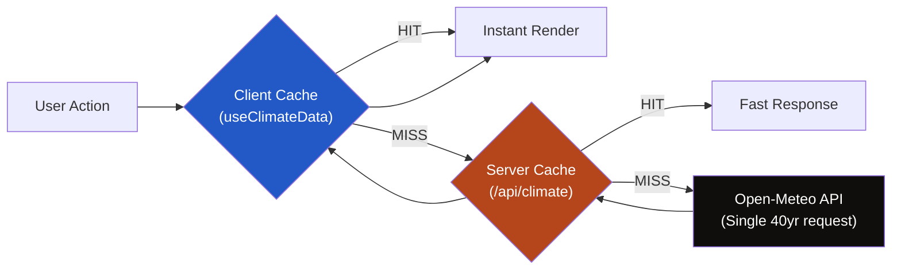
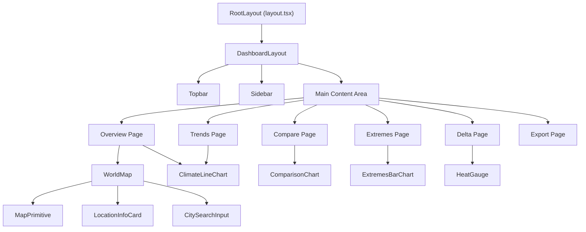

# GENOME v3.4 — Technical Documentation 🧬

> A high-performance, neobrutalist environmental intelligence platform for 40-year climate risk assessment, interactive geocognition, and real-time system monitoring.

[](https://nextjs.org/)
[](https://www.typescriptlang.org/)
[](https://www.mongodb.com/)
[](LICENSE)

---

## Table of Contents

1. [System Architecture](#system-architecture)
2. [Tech Stack](#tech-stack)
3. [Data Flow Pipeline](#data-flow-pipeline)
4. [API Reference](#api-reference)
5. [Authentication System](#authentication-system)
6. [Caching Architecture](#caching-architecture)
7. [Frontend Component Hierarchy](#frontend-component-hierarchy)
8. [State Management](#state-management)
9. [Design System](#design-system)
10. [Mobile Responsiveness](#mobile-responsiveness)
11. [Environment Setup](#environment-setup)
12. [Development](#development)

---

## System Architecture



---

## Tech Stack

| Layer | Technology | Purpose |
|---|---|---|
| **Framework** | Next.js 15 (App Router, Turbopack) | Server-side rendering, API routes, file-based routing |
| **Language** | TypeScript 5 | Type safety across client and server |
| **UI** | React 19 | Component rendering and state management |
| **Styling** | Vanilla CSS (custom design tokens) | Neobrutalist design system with zero utility frameworks |
| **Charts** | Chart.js + react-chartjs-2 | Climate time-series, comparison, and extremes visualizations |
| **Maps** | React-Leaflet + Leaflet | Interactive world map with CartoDB Dark Matter tiles |
| **Database** | MongoDB + Mongoose | User accounts, saved locations, password reset tokens |
| **Auth** | NextAuth.js v5 (beta) | Session-based authentication with credentials provider |
| **Caching** | SWR + custom Map caches | Multi-layer data caching (client + server) |
| **HTTP** | Axios | API calls with retry logic |
| **Hashing** | bcryptjs | Password hashing (10 salt rounds) |
| **Validation** | Zod + react-hook-form | Form validation schemas |
| **Theming** | next-themes + custom ThemeContext | Dark/light mode with CSS variable switching |

---

## Data Flow Pipeline

This diagram traces a single user interaction from map click to rendered chart:



---

## API Reference

### `GET /api/climate`

Fetches 40 years of historical climate data for a coordinate pair.

| Parameter | Type | Required | Description |
|---|---|---|---|
| `lat` | `string` | ✅ | Latitude (-90 to 90) |
| `lng` | `string` | ✅ | Longitude (auto-normalized to -180 to 180) |

**Response** — `200 OK`:
```json
[
  {
    "year": 1985,
    "avgTemp": 24.3,
    "totalPrecip": 1245.6,
    "extremeHeatDays": 12,
    "extremeRainDays": 3
  }
]
```

**Error Responses**: `400` (missing params), `429` (rate limit), `500` (server error)

**Internal Logic**:
1. Parse and normalize longitude: `((lng + 180) % 360 + 360) % 360 - 180`
2. Generate cache key: `lat.toFixed(2),lng.toFixed(2)` (~1km precision)
3. Check server-side `Map` cache (24h TTL)
4. On miss: single GET to `archive-api.open-meteo.com` for full 40-year range
5. Aggregate raw daily data into yearly summaries (avgTemp, totalPrecip, extremeHeatDays, extremeRainDays)
6. Store result in server cache and return JSON

---

### `GET /api/health`

Real-time platform health check. Polled by `useSystemHealth` hook every 30 seconds via SWR.

**Response** — `200 OK`:
```json
{
  "status": "healthy",
  "timestamp": "2026-03-26T14:30:00.000Z",
  "services": {
    "database": "operational",
    "api": "operational"
  },
  "metrics": {
    "latency": "2ms",
    "uptime": 86400
  }
}
```

**Error Response** — `503`: Database connection failed.

---

### `GET/POST/DELETE /api/user/saved-locations`

CRUD operations for user-pinned map locations. All routes require authentication.

| Method | Action | Body / Params |
|---|---|---|
| `GET` | List all saved pins | — |
| `POST` | Save a new pin | `{ lat, lng, label }` |
| `DELETE` | Remove a pin | `?id=<mongoId>` |

---

### `POST /api/register`

Creates a new user account.

| Field | Type | Validation |
|---|---|---|
| `name` | `string` | Required |
| `email` | `string` | Required, unique |
| `password` | `string` | Required, min 6 chars |

Password is hashed with `bcryptjs` (10 salt rounds) before storage.

---

### `POST /api/auth/forgot-password`

Generates a password reset token (1h expiry) and logs the reset URL to the server console.

```
POST { "email": "user@example.com" }
→ Always returns 200 OK (prevents email enumeration)
→ Console: PASSWORD RESET REQUESTED — Reset Link: /reset-password/<token>
```

---

### `POST /api/auth/reset-password`

Validates the token, hashes the new password, and clears the reset token from the user record.

---

## Authentication System



**Key Design Decisions**:
- **Granular error codes**: `EmailNotFound`, `WrongPassword`, `TooManyAttempts` — mapped to user-friendly UI messages
- **AuthButton component**: State machine with `idle → loading → success` transitions
- **ErrorBanner component**: Auto-dismissing (5s), animated shake effect

---

## Caching Architecture

Genome uses a **3-layer caching strategy** to minimize API calls and maximize responsiveness:



| Layer | Location | TTL | Key Precision | Scope |
|---|---|---|---|---|
| **L1: Client Cache** | `useClimateData.ts` (module-level `Map`) | 24 hours | ~1km (2 decimal places) | Shared across all dashboard pages |
| **L2: Server Cache** | `api/climate/route.ts` (module-level `Map`) | 24 hours | ~1km (2 decimal places) | Shared across all server requests |
| **L3: AQI Cache** | `WorldMap.tsx` (module-level `Map`) | 1 hour | ~1km (2 decimal places) | Map component only |
| **L4: Geocoding Cache** | `CitySearchInput.tsx` (module-level `Map`) | 1 hour | Exact query string | Search input only |

**Cache Invalidation**: The `refetch()` function in `useClimateData` deletes the specific key from L1 cache before re-fetching, which cascades to L2.

---

## Frontend Component Hierarchy



---

## State Management

Genome uses **React Context** for global coordinate state and **module-level caches** for data persistence:

| State | Provider | Consumed By |
|---|---|---|
| Selected coordinates | `CoordinateContext` | All dashboard pages, Topbar |
| Location metadata (city, AQI, timezone) | `CoordinateContext` | WorldMap, Dashboard, Topbar |
| Climate data (City A / City B) | `CoordinateContext` | Compare page |
| Theme (dark/light) | `ThemeContext` | Topbar, MapPrimitive, all charts |
| System health | `useSystemHealth` (SWR) | Topbar |
| Climate data (per-location) | `useClimateData` (hook) | Dashboard, Trends, Delta, Extremes |

---

## Design System

Genome follows a **Neobrutalist** design language:

| Token | Value | Purpose |
|---|---|---|
| `--ink` | `#0f0e0d` / `#ede8dc` | Primary text, borders |
| `--paper` | `#f5f0e8` / `#131210` | Background surfaces |
| `--accent` | `#b5451b` / `#d4672a` | Interactive elements, temperature |
| `--blue` | `#2259c7` / `#4d7ff0` | Precipitation, secondary data |
| `--mono` | `Space Mono` | All UI text |
| `--serif` | `Instrument Serif` | Headlines, decorative |
| `border-radius` | `0` everywhere | Brutalist edges |

**Dark mode**: Toggled via `ThemeContext`, which adds `html.dark` class. All CSS variables are re-mapped in the `html.dark` selector.

---

## Mobile Responsiveness

Single breakpoint at `768px`:

| Component | Desktop | Mobile (<768px) |
|---|---|---|
| Sidebar | Fixed 190px column | Slide-in overlay drawer |
| Topbar | Full row with coords | Compact; coords hidden |
| Panel Grid | 2-column CSS grid | 1-column stack |
| Auth Pages | 2-column (branding + form) | 1-column (form only) |
| Map | 210px height | 260px (touch-friendly) |

**Sidebar Drawer**: Uses `CustomEvent('sidebar-toggle')` dispatched by the hamburger button in `Topbar.tsx` and listened by `Sidebar.tsx`.

---

## Environment Setup

Create `.env.local` in the project root:

```env
MONGODB_URI=mongodb+srv://<user>:<pass>@cluster.mongodb.net/genome
NEXTAUTH_URL=http://localhost:3000
NEXTAUTH_SECRET=your-random-secret-key
```

---

## Development

```bash
# Install dependencies
npm install

# Start dev server (Turbopack)
npm run dev

# Production build
npm run build

# Start production server
npm start
```

---

<p align="center">
  Built with precision by <b>Genome Systems</b> · © 2026<br/>
  <i>Next.js 15 · React 19 · MongoDB · Chart.js · Leaflet</i>
</p>
